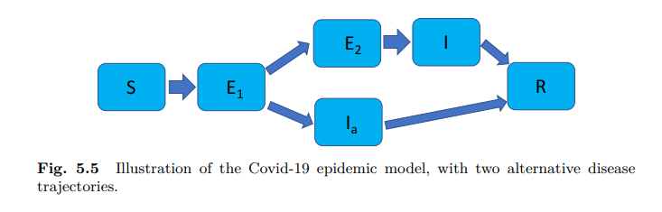
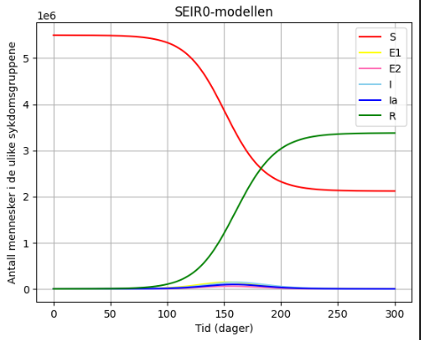
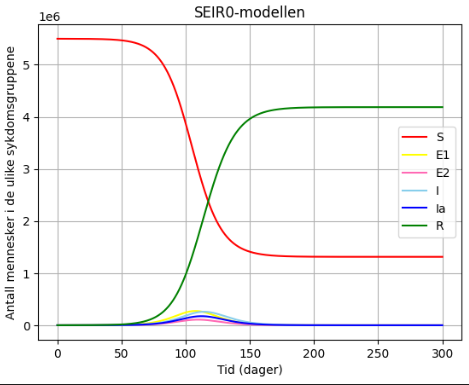
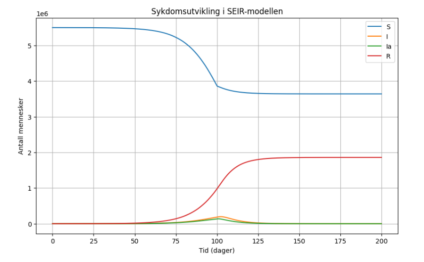
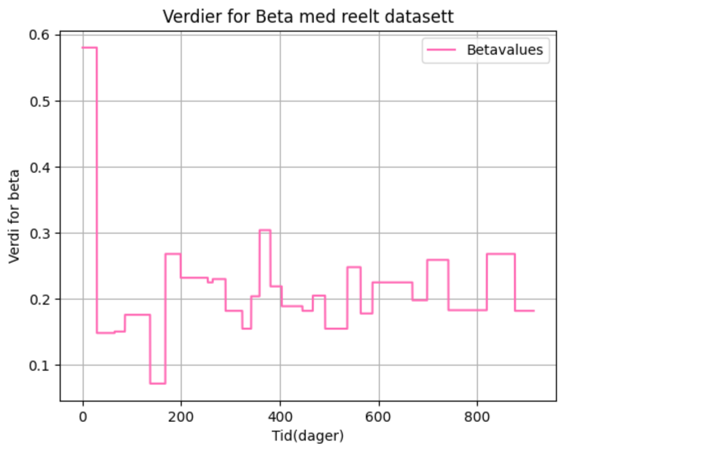
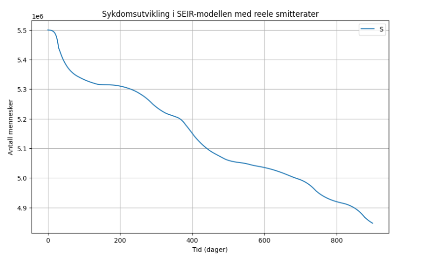
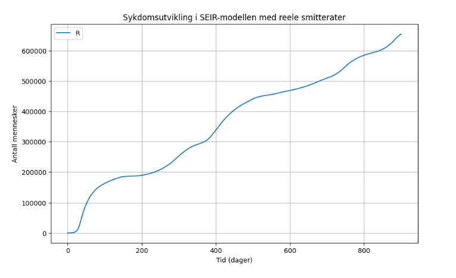
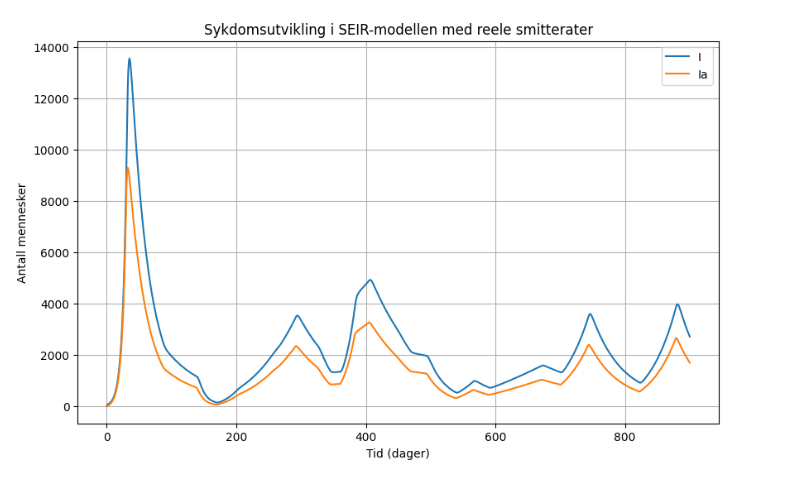

# Simulering av smittespredning med ODE-modeller i Python

## Prosjektoppgave IN1900, høst 2025

I denne oppgaven skal implementeres en ODE-basert versjon av SEEIIR-modellen, som tilsvarer modellen  Folkehelseinstituttet (FHI) brukte for å beskrive spredningen av Covid-19-pandemien. Oppgaven implementere  modellen som et system av differensialligninger og simulerer smitteutviklignen over tid av smitteutviklingen over tid. Oppgaven tar utgangspunkt i modellen beskrevet i kapittel 5 i boken ([Solving
Ordinary Differential Equations in Python](https://link.springer.com/book/10.1007/978-3-031-46768-4)). 

### Notasjonen i oppgaven

Under analysen av de ulike befolkningsgruppene brukte vi følgende notasjon:

- **S** = Mottakelige (susceptible)
- **E₁** = Eksponert for smitte, men ikke smittsom
- **E₂** = Eksponert for smitte og smittsom
- **I** = Smittet med symptomer
- **Iₐ** = Smittet uten symptomer (asymptomatisk)
- **R** = Frisk / fjernet fra smitteforløpet (recovered)
- **N** = Totalt antall individer i befolkningen
Figuren under viser overgangen fra de ulike gruppene av befolkningen i SEEIIR-modellen.

## SEEIIR-modellen

### Systemet av  differensiallikninger
Dette systemet modellerer hvordan en smittsom sykdom sprer seg i en befolkning. Modellen tar hensyn til forskjeller i smittsomhet og inkubasjonstid, og beskriver dynamikken mellom smitte, sykdomsutvikling og immunitet. Dette gir følgene system av differensiallikniger:

##### **S** = Mottakelige (susceptible)
    

  
$$ S'(t) = - \beta \frac{S I}{N} - r_{ia} \beta \frac{S I_a}{N} - r_{e2} \beta \frac{S E_2}{N}, $$

  - Sårbare personer reduseres når de smittes av noen som er enten 
  symptomatiske, asymptomatiske, eller i en smittsom inkubasjonsfase.
##### **E₁** = Eksponert for smitte, men ikke smittsom

  
$$ E_1'(t) = \beta \frac{S I}{N} + r_{ia} \beta \frac{S I_a}{N} + r_{e2} \beta \frac{S E_2}{N} - \lambda_1 E_1 $$

- Personer går fra sårbar → eksponert når de blir smittet, og forlater eksponert-fasen med hastighet $\lambda_1$ når de går videre til enten asymptomatisk eller symptomatisk fase. 

##### **E₂** = Eksponert for smitte og smittsom

  
$$ E_2'(t) = \lambda_1 (1 - p_a) E_1 - \lambda_2 E_2, $$

 - Fra $E_1$ går en andel $1 - p_a$ til $E_2$ (blir symptomatiske)
 - De forlater $E_2$ til i med hastighet $\lambda_2$

##### **I** = Smittet med symptomer

$$I'(t) = \lambda_2 E_2 - \mu I, $$

- Symptomatiske får smitte fra $E_2$ og forlater $I$ når de blir friske eller isolert

##### **Iₐ** = Smittet uten symptomer (asymptomatisk)

 
$$I_a'(t) = \lambda_1 p_a E_1 - \mu I_a, $$

  - De kommer direkte fra $E_1$ med en andel $p_a$
  - De forlater denne gruppen når de blir friske med samme rate $\mu$
  - Asymptomatiske blir smittet, men har ingen symptomer

##### **R** = Frisk / fjernet fra smitteforløpet (recovered)

 
$$R'(t) = \mu (I + I_a) $$

- De som er friske. ALle som er blitt friske går fra $I$ eller $I_a$

## Parametrene

- $\beta$: **Smittefrekvens** mellom en smittet og en sårbar person.  
- $r_{ia}$: Relativ smittsomhet til asymptomatiske ($I_a$) sammenlignet med symptomatiske ($I$).  
- $r_{e2}$: Relativ smittsomhet til pre-symptomatiske ($E_2$).  
- $\lambda_1$: Hastighet for å gå fra $E_1 \to E_2$ eller $E_1 \to I_a$ (tilsvarer $1 /$ inkubasjonstid i første fase).  
- $\lambda_2$: Hastighet for å gå fra $E_2 \to I$ (tilsvarer $1 /$ inkubasjonstid i andre fase).  
- $p_a$: Sannsynlighet for å bli **asymptomatisk**.  
- $\mu$: Gjenopprettingsrate (tilsvarer $1 /$ varighet av infeksjon).

## Modelering med konstante parametere 
### ([scriptet SEIR0.py](https://github.com/ragnhild-thielemann/Oblig-IN1900/blob/main/scr/SEIR0.py))
#### Realistiske, konstante verdier for modellering

| Parameter | Verdi |
|-----------|-------|
| $\beta$   | 0.33  |
| $r_{ia}$  | 0.1   |
| $r_{e2}$  | 1.25  |
| $\lambda_1$ | 0.33 |
| $\lambda_2$ | 0.5  |
| $p_a$    | 0.4   |
| $\mu$    | 0.2   |

#### Startverdier for befolknigen
  - **S_0** = $5.5 \times 10^{6}$ 
  - **E₂_0** = 100
  - **E₁_0** = **Iₐ** = **R** = **I** = 0
  - **T** = 200 (vi modelerer over 200 dager)
  - **N** = 400 (vi bruker 400 datapunkter).
#### Dersom vi setter $\beta$ konstant lik 0.33 gir det plottet
  
 
#### Dersom vi øker $\beta$ til 0.4, altså har en høyere smittefrekvens får vi dette plottet

Av figurene ser man først og fremst at antall personer som blir immune $(\(R(t)\))$ øker raskt over tid. Når smittefrekvensen ($\beta$) økes, stiger også kurven for immune raskere, fordi flere individer smittes og går gjennom sykdomsforløpet før de til slutt når $\(R\).$ Dette kommer av at systemet for differensiallikninger, der vi har

$$
E_1'(t) =
\frac{\beta S I}{N} + r_i \frac{\beta S I_a}{N} + r_e^2 \frac{\beta S E_2}{N},
\$$

Antall smittede som ikke merker symptomer øker når $\beta$ øker, som igjen har ringvirkninger for de andre sykdomsgruppene. Modellen viser dermed at selv små endringer i ($\Delta$ $\beta$ = 0.4-0.33=0.07) har stor effekt på hvor raskt befolkningen oppnår immunitet. Plottene viser også at vesentlig flere blir imune med høyere smittefrekvens $\beta$, noe som gir mening, da flere gjennomgår et sykdomsforløp. 

## Modelering med variabel verdi for smitterate
### ([scriptet outbreak.py](https://github.com/ragnhild-thielemann/Oblig-IN1900/blob/main/scr/outbreak.py))

Når en pandemi intreffer, er vil myndighetene med all sansynlighet sette inn tiltak for at smittefrekvensen ($\beta$) avtar. I første del av å gjøre modellen mer realistisk, oppretter vi en "piecewise function" for smittefrekvensen, der smittefrekvensen avtar over tid. Vi setter smittefrekvensen til 0.4 de 100 dagene før myndighetene har satt inn virksomme tiltak, og 0.083 etter myndightene har satt inn tiltak. 

$$
\beta(t) =
\begin{cases}
0.4, & \text{for } t < 100, \\
0.083, & \text{for } t \geq 100.
\end{cases}
$$ 

Det gir følgene plot for sykdomsutviklingen i de ulike befolkningsgruppene

 

Simuleringen viser hvordan nedstengingen som innføres etter 100 dager får smittespredningen til å avta betydelig og flate ut. Både antall smitteutsatte og antall imune stabiliserer seg, da sykdomspredningen i befolkningen er tilnærmet lik 0. ($\beta$ = 0.083). Norge var ikke forberedt på en pandemi, men ved at smitten ble brems, fikk helsevesenet tid til å tilpasse kapasiteten, bestille nødvendig utstyr som munnbind og respiratorer, og organisere test- og karantenetiltak for å håndtere sykdommen mer effektivt. Å bremse sykdomspredningen var nødvendig for å hindre dødsfall.

### Estimering av antall respiratorplasser som kreves
I [scriptet SEIR.py](https://github.com/ragnhild-thielemann/Oblig-IN1900/blob/main/scr/SEIR.py) estimerte  hvor mange respiratorplasser som vi hadde krevd dersom, dersom myndighetene ikke hadde iverksatt tiltak.($\beta$ med konstant verdi på 0.33) Vi la til grunn at 20 % av de smittede med Covid-19 utvikler alvorlig sykdom, og at 5 % av disse igjen ville trenge respiratorbehandling.

Beregningene våre viste et maksimalt behov på 1423 respiratorplasser, altså mer enn dobbelt så mange som den tilgjengelige kapasiteten på 700 plasser. Dette illustrerer tydelig hvor kritisk det var å sette inn tiltak for å redusere smittespredning og forhindre unødvendige dødsfall. 

## Modellering med reele verdier for smitterate

I siste del av prosjektet brukte vi FHIs anslag for smitteraten ($\beta$) for å lage en mer realistisk modell for sykdomsutviklingen. I scriptet ([lockdown.py](https://github.com/ragnhild-thielemann/Oblig-IN1900/blob/main/scr/lockdown.py)) har vi en klasse som håndterer dataene fra tekstfilen beta.txt, og omformer dem til to arrays. Disse arrayene plottes deretter for å gi en visuell fremstilling av hvordan smitteraten ($\beta$) endrer seg over tid. Endringene i $\beta$ reflekterer hvordan samfunnet åpnes og lukkes, og hvordan graden av smittebegrensende tiltak varierer.

I scriptet ([covid19.py](https://github.com/ragnhild-thielemann/Oblig-IN1900/blob/main/scr/covid19.py)) bruker vi dataene fra FHI til å modelere hvordan sykdomsutvikligen skjer med varierende verdier for smitterate ($\beta$). 
Vi har laget separate plott for de ulike populasjonsgruppene S, R, Ia og I, siden de numeriske verdiene er så store at de ikke lar seg sammenligne i samme diagram uten å miste detaljert informasjon.

Plottet for S viser en jevn nedgang over tid, mens R øker tilsvarende, men med ulik derivert ettersom smitteraten endrer seg over tid. Dette illustrerer hvordan tiltak og åpninger i samfunnet påvirker hastigheten på smittespredningen.

I plottet for I og Ia ser vi at antallet smittede er svært høyt i starten, noe som samsvarer med plottet for smitteraten $\beta$, som også er på sitt høyeste i begynnelsen. Etter hvert normaliseres antallet smittede, men vi observerer tydelige “fjelltopper”, som representerer smittetoppene i perioden med varierende tiltak. Dette viser hvordan endringer i $\beta$ direkte påvirker både tidspunkt og størrelse på smittebølgene, og understreker viktigheten av dynamiske modeller for å forstå sykdomsutvikling i et samfunn under tiltak.
## Avsluttning
Dette prosjektet viser hvordan matematiske modeller og Python kan brukes til å forstå og forutsi smittespredning under en pandemi. Ved å kombinere SEIR-modellen med FHI-data ser vi tydelig hvordan smitterate og tiltak påvirker sykdomsutviklingen, antall syke og behovet for respiratorer. Modellene våre illustrerer at uten tiltak ville kapasiteten vært kraftig overskredet, mens dynamiske endringer i smitte gir tydelige smittetopper som normaliseres over tid. Prosjektet understreker hvordan datadrevne modeller kan være et viktig verktøy i beslutningstaking og planlegging under helsekriser.
